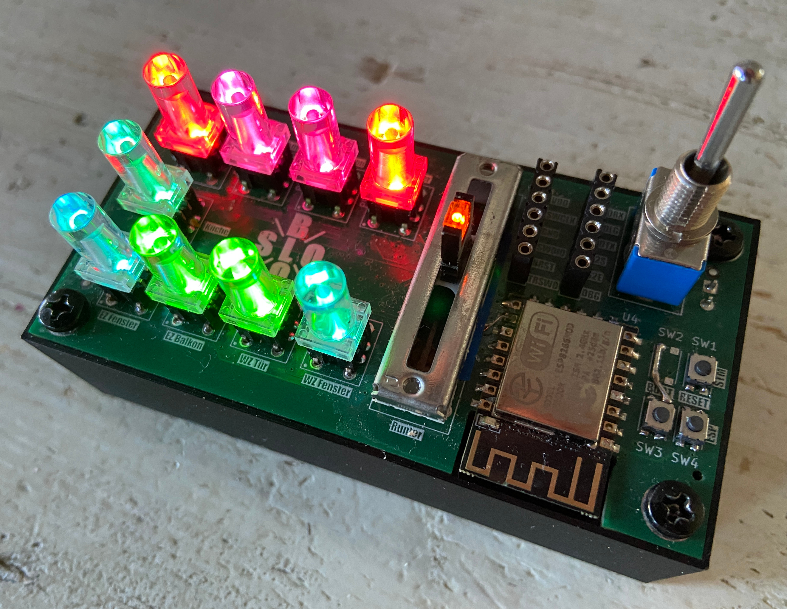

# Tahoma Remote

## Overview
This device is an internet independent shutter control using the Tahoma Local API. At the same time, it serves as a proof of concept for integration of STM32F405 MCU with an ESP8266 using UART communication and Espressif AT command set.

Both hard and software are tailored to the requirements of my domestic Somfy roller shutter installation, consisting of 9 roller shutters controlled by a Tahoma Switch. The layout of buttons reflect the location of roller shutters looking top down to the flat for easy orientation. Adding/removing shutters to the setup is possible, but may require adaption of both hard and software.

This repository contains all ressources to build the device:
 * the firmware for the STM32 MCU
 * a script to upload ESP AT firmware to the ESP MCU
 * the board's KiCad design
 * a 3D model housing the board

## Operation
 * Switch the device on
 * During the startup sequence, Tahoma Remote
   * initializes communication to ESP
   * sets up WIFI connection
   * fetches current shutter states from Tahoma Switch
 * The button colours reflect the actual shutter closures of each motor in HSV colour space:
   * green = up
   * blue = 50%
   * red = closed
   * and any colour inbetween
 * Choose your target closure amount using the slider pot
 * Hit the buttons of corresponding shutters to execute the target closure command
 * While motors are moving, corresponding buttons are blinking
 * Motor status is updated each 1,5 seconds

## Highlights
As a proof of concept, these are the feature highlights of the project:
 * DMA driven UART communication between STM32F405 and ESP8266
 * Client side implementation of AT command set
 * Using Tahoma Local API. No internet required!
 * JSON stream parsing for memory efficient payload consumption (big up for the great [lwjson](https://github.com/MaJerle/lwjson.git) project!)
 * Highly capable RGB Led driver implementation using DMA, I2C and PCA9685PW driver chips
 * FreeRTOS for independent UI and communication threads
 * All firmware code written in plain C/C++ using STM32 LL (Low Level) API
 * Compact design
 * Battery powered

## Installation Notes
### Flashing ESP Firmware
 1. Install esptool using

        brew install esptool
 2. Go to https://github.com/espressif/esp-at/releases and find the link for the latest ESP8266 compatible AT firmware, such as

    [ESP-WROOM-02-AT-V2.3.0.0.zip](https://dl.espressif.com/esp-at/firmwares/esp8266/ESP-WROOM-02-AT-V2.3.0.0.zip)
 3. Download and extract the file into ESP subfolder. 
    Within the "factory" subfolder, the archive will contain the firmware binary file called "factory/factory_WROOM-02.bin"

 4. Connect a USB serial adapter such as FTDI Friend or Arduino Uno

        USB Serial Adapter            Tahoma Remote
                       GND ---------> GND
                        TX ---------> EDTX
                        RX ---------> EDRX

 5. Press and hold the ESP Boot button on Tahoma Remote and switch the device on. Then release the button again.
 6. Go to ESP subfolder and issue uploadATFW.sh script (check and apply correct settings regarding PORT and FWPATH variable!)

        ./uploadATFW.sh

    If the command is not executable, add respective rights to it:

        chmod u+x uploadATFW.sh
    
    The expected output looks something like this:

        esptool v5.1.0
        Connected to ESP8266 on /dev/cu.usbserial-XXX:
        Chip type:          ESP8266EX
        Features:           Wi-Fi, 160MHz
        Crystal frequency:  26MHz
        MAC:                e0:98:06:0a:71:a6
        
        Stub flasher running.
        
        Configuring flash size...
        Flash will be erased from 0x00000000 to 0x001fffff...
        Flash parameters set to 0x0241.
        Wrote 2097152 bytes (582385 compressed) at 0x00000000 in 54.0 seconds (310.8 kbit/s).
        Hash of data verified.
        
        Hard resetting via RTS pin...
    
### Flashing STM32 firmware
 1. Install VS Code
 2. Install STM32Cube Extensions for VS Code
 3. Add lwjson as submodule to the project

        git submodule add https://github.com/MaJerle/lwjson.git
        git submodule update --init
 4. Rename config_example.h to config.h and configure your local credentials and system information:
   * WIFI_SSID: your WIFI SSID
   * WIFI_PASSWD: your WIFI password
   * TAHOMA_HOST: the Tahoma Switch hostname, typically in the form 'gateway-\<box pin code\>.local'
   * TAHOMA_AUTH: the developer token generated within Somfy App
   * shutterConfigTable takes a set of roller shutters in the system (see TahomaManger.h for the structure of ShutterConfig entries)
 5. Configure and build the project using device STM32F405RGT6 and GCC toolchain in VSCode
    
    alternatively, if cmake and ninja are installed on the system, you can run these commands:

        cmake --preset Release
        cmake --build --preset Release
 6. Connect ST-Link to the SWO interface on Tahoma Remote
 7. Flash the firmware: Run and Debug and apply "STM32Cube: STLink GDB Server"
